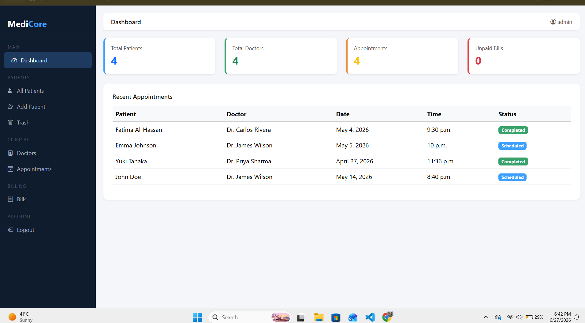
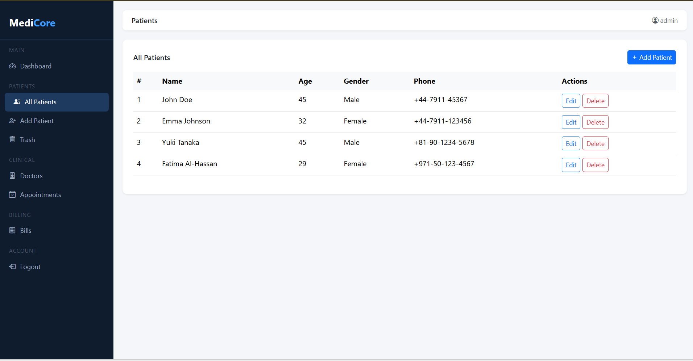
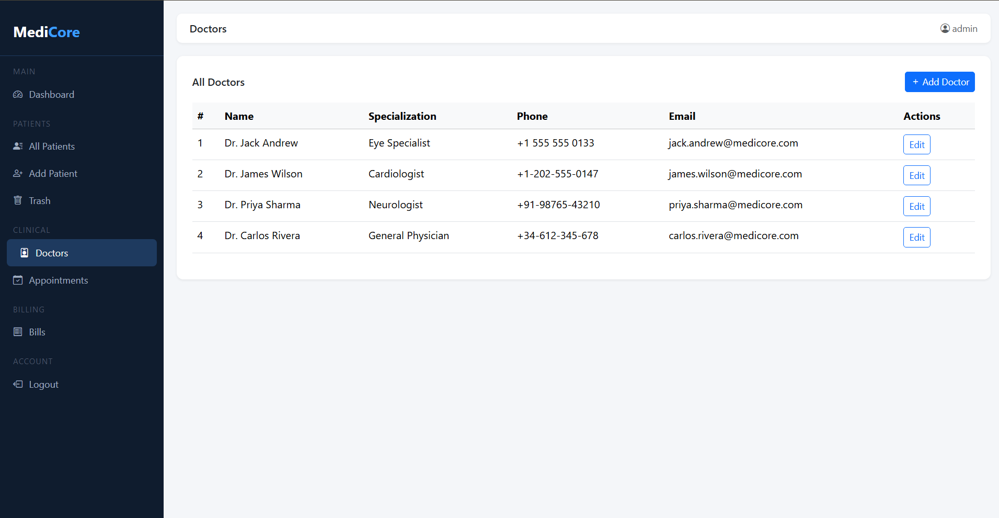
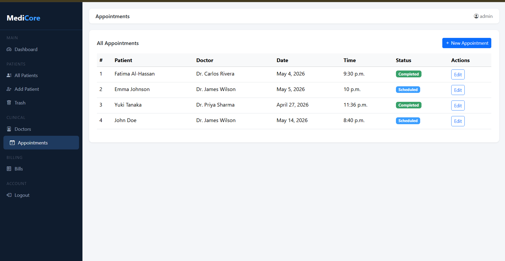
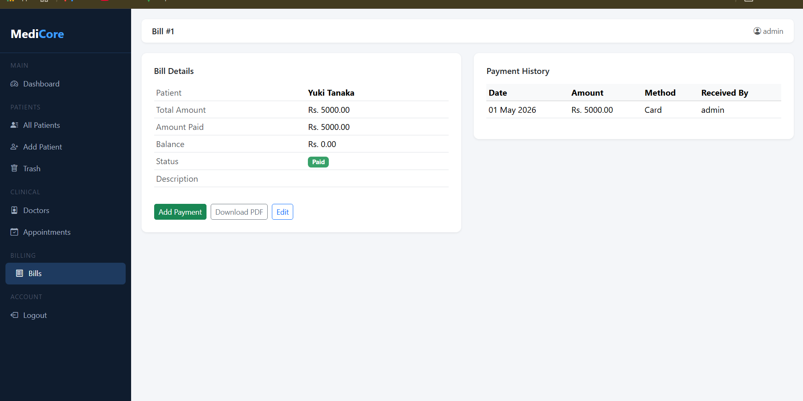

# 🏥 MediCore – Hospital Management System

A modern Hospital Management System built with **Django** and **PostgreSQL** for managing patients, doctors, appointments, billing, and payments. The application is deployed on Railway and uses Neon PostgreSQL as the production database.

## 🌐 Live Demo

https://medicore-production-8796.up.railway.app

> **Admin Panel**
>
> https://medicore-production-8796.up.railway.app/admin/

---

# ✨ Features

### 👨‍⚕️ Doctor Management
- Register doctors
- Edit doctor information
- View doctor directory

### 🧑‍🤝‍🧑 Patient Management
- Add patients
- Update patient records
- Soft delete & restore patients
- Patient listing

### 📅 Appointment Management
- Schedule appointments
- Update appointment status
- View appointments

### 💳 Billing System
- Generate bills
- Track paid amount
- Calculate remaining balance
- Bill status (Paid / Partial / Unpaid)

### 💰 Payment Management
- Record payments
- Payment history
- Multiple payment methods

### 📄 PDF Generation
- Download printable invoices
- Professional PDF bills using ReportLab

### 🔐 Authentication
- Django Admin authentication
- Secure login
- Session management

### ☁️ Deployment
- Railway hosting
- Neon PostgreSQL database
- WhiteNoise static file serving
- Gunicorn production server

---

# 🛠 Tech Stack

- Python 3
- Django 6
- PostgreSQL (Neon)
- Railway
- HTML5
- CSS3
- Bootstrap 5
- WhiteNoise
- Gunicorn
- ReportLab

---

# 📷 Screenshots

## Dashboard



---

## Patients



---

## Doctors



---

## Appointments



---

## Bills



---

## Payments


---

# 🚀 Local Installation

Clone the repository

```bash
git clone https://github.com/FurqanAthar28/medicore.git
cd medicore
```

Create virtual environment

```bash
python -m venv env
```

Activate environment

### Windows

```bash
env\Scripts\activate
```

### Linux / macOS

```bash
source env/bin/activate
```

Install dependencies

```bash
pip install -r requirements.txt
```

Run migrations

```bash
python manage.py migrate
```

Create superuser

```bash
python manage.py createsuperuser
```

Run server

```bash
python manage.py runserver
```

---

# ⚙️ Environment Variables

Create a `.env` file in the project root.

```env
SECRET_KEY=your_secret_key
DEBUG=True
DATABASE_URL=your_database_url
ALLOWED_HOSTS=localhost,127.0.0.1
CSRF_TRUSTED_ORIGINS=http://localhost:8000
```

---

# 📦 Deployment

This project is deployed using:

- Railway
- Neon PostgreSQL
- WhiteNoise
- Gunicorn

---

# 📁 Project Structure

```
core/
patients/
templates/
static/
screenshots/
manage.py
requirements.txt
build.sh
README.md
```

---

# 👨‍💻 Author

**Furqan Athar**

GitHub:
https://github.com/FurqanAthar28

LinkedIn:
https://www.linkedin.com/in/furqan-athar/

---

# 📄 License

This project is intended for educational and portfolio purposes.
